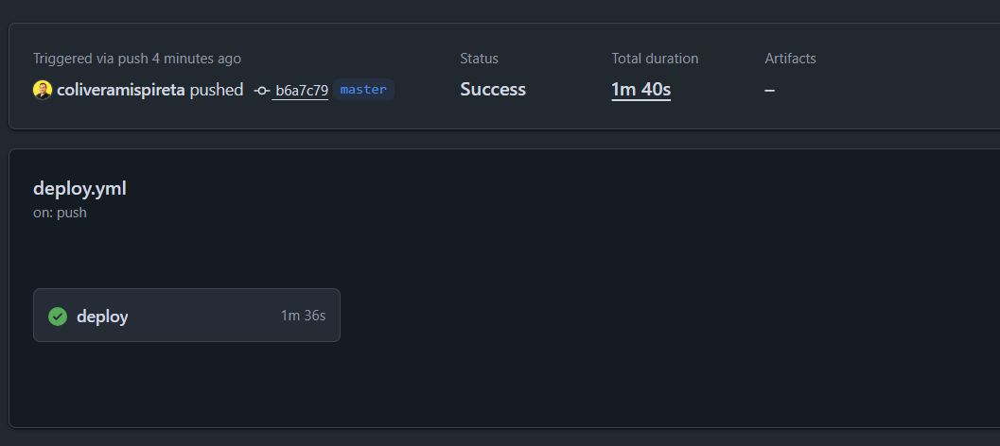

# Frontend - CRUD Guru Challenge

## Descripción

Frontend desarrollado en **Next.js**, **TypeScript** y **Material UI (MUI)**.

Este frontend **consume las Lambdas desplegadas en AWS** (expuestas mediante API Gateway y conectadas a DynamoDB).  
La **autenticación se maneja con Amazon Cognito**, integrada con el proyecto a través de **AWS Amplify**.

- Implementa autenticación, dashboard con CRUD de tickets, perfil de usuario y sección de preguntas frecuentes.
- Consume Lambdas de desarrollo / produccion segun variable --stage.
- Soporta **multi-stage deployments** (`dev` y `prod`) vía **GitHub Actions**.

### Autenticación

- Es necesario **crear previamente un cliente en Cognito** para poder autenticar usuarios.
- Existe una **Lambda PreSignUp** que confirma automáticamente cada usuario al momento de registrarse.
- Se implementó **inicio de sesión con Google** usando el flujo **implícito** de OAuth2, redirigiendo al usuario con valores encriptados en el hash de la URL.

## Arquitectura

- **Framework**: Next.js + TypeScript
- **UI Library**: Material UI (MUI)
- **Secciones principales**:
  - Landing Page
  - Login (Cognito + Google OAuth)
  - Dashboard (tabla + CRUD de tickets)
  - Mi Perfil
  - Preguntas frecuentes (FAQ)

---

El build está configurado para exportar los archivos estáticos a la carpeta `out/`, que se sube automáticamente a un bucket **S3** configurado como hosting estático.  
El contenido es distribuido globalmente con **CloudFront**, apuntando a un dominio.

---

## Pre-requisitos

- Node.js v20.x
- npm v9.x
- AWS CLI configurado con credenciales
- Git

---

## Instalación

```bash
# Clona el repositorio
git clone https://github.com/tu-usuario/serverless-crud-guru-challenge.git

# Posiciónate en la carpeta raíz
cd serverless-crud-guru-challenge-front

# Instala dependencias
npm ci
```

## Variables de entorno

Antes de levantar el proyecto de manera local, es necesario crear el archivo **`.env.local`** en la raíz del proyecto con las siguientes variables:

```bash
# API Gateway (Lambdas)
NEXT_PUBLIC_API_URL_LAMBDA_LOCAL=
NEXT_PUBLIC_API_URL_LAMBDA_DEV=
NEXT_PUBLIC_API_URL_LAMBDA_PROD=

# Tokens de autenticación
NEXT_PUBLIC_AUTH_TOKEN_LOCAL=
NEXT_PUBLIC_AUTH_TOKEN_DEV=
NEXT_PUBLIC_AUTH_TOKEN_PROD=

# Redirecciones Cognito / Google OAuth
NEXT_PUBLIC_REDIRECT_SIGNIN_DEV=
NEXT_PUBLIC_REDIRECT_SIGNIN_PROD=
NEXT_PUBLIC_REDIRECT_SIGNOUT_DEV=
NEXT_PUBLIC_REDIRECT_SIGNOUT_PROD=
```

## Build

```bash
# Build en modo development
npm run build-dev

# Build en modo production
npm run build-prod

# Exportar build estático a carpeta out/
npm run export
```

## Server Offline (desarrollo local)

```bash
# Desarrollo local (Linux/Mac)
npm run dev

# Desarrollo local (Windows)
npm run localwin

# Desarrollo en stage "development" (Windows)
npm run devwin

# Desarrollo en stage "production" (Windows)
npm run prod

```

## Lint y Formateo

```bash
# Ejecuta ESLint sobre el código fuente
npm run lint

# Formatea el código con Prettier
npm run format

# Revisar tipado con TypeScript (watch)
npm run ts-lint
```

## GitHub Actions - Secrets

Para que el pipeline de despliegue funcione correctamente, es necesario configurar los siguientes secrets en tu repositorio de GitHub:

```bash
# API URLs
API_URL_LAMBDA_LOCAL
API_URL_LAMBDA_DEV
API_URL_LAMBDA_PROD

# Tokens de autenticación
AUTH_TOKEN_LOCAL
AUTH_TOKEN_DEV
AUTH_TOKEN_PROD

# AWS credentials
AWS_ACCESS_KEY_ID
AWS_SECRET_ACCESS_KEY
AWS_REGION

# Distribuciones de CloudFront
DISTRIBUTION_ID_DEV
DISTRIBUTION_ID_PROD

# Redirecciones Cognito / Google OAuth
REDIRECT_SIGNIN_DEV
REDIRECT_SIGNIN_PROD
REDIRECT_SIGNOUT_DEV
REDIRECT_SIGNOUT_PROD

# Buckets S3
S3_BUCKET_DEV
S3_BUCKET_PROD
```

## Deploy

```bash
# Deploy a Dev
npm run deploy:dev

# Deploy a Prod
npm run deploy:prod
```

---

---

## Husky y Lint-Staged

Este proyecto usa **Husky** para ejecutar validaciones antes de cada commit.  
Es decir, al hacer un commit se dispara el hook `pre-commit`, ejecutando los siguientes comandos:

```bash
npx lint  # → corre ESLint se ejecuta se reglas del archivo de configuracion de ESlint.
npm format # → ejecuta los formatos.
```

Si los tests fallan o hay errores de lint/format, el commit no se ejecuta.  
De esta forma se asegura que no entren commits con errores de formato o tests fallidos al repositorio.

## CI/CD (GitHub Actions)

La integración continua y despliegue automático se realiza mediante **GitHub Actions**.

- Cada push a la rama development genera un build en modo dev y despliega al bucket S3 (stage dev).
- Cada push a la rama master genera un build en modo prod y despliega al bucket S3 (stage prod).

## Flujo de Workflow

- Archivo: `.github/workflows/deploy.yml`
- next build && next export → genera carpeta out/.
- aws s3 sync ./out s3://<bucket-name> --delete → sube los archivos a S3.
- CloudFront invalida caché para servir la nueva versión.

```text
S3 → hosting estático de los assets exportados de Next.js.
CloudFront → distribución global con dominio configurado.
GitHub Actions → pipeline automático con ramas development (dev) y master (prod).
```

### Branches y multi-stage deployments

| Branch        | Stage |
| ------------- | ----- |
| `development` | Dev   |
| `master`      | Prod  |


---

## Cada push a `master` dispara un deploy al stage **prod**.




---

## Cada push a `development` dispara un deploy al stage **dev**.


---
